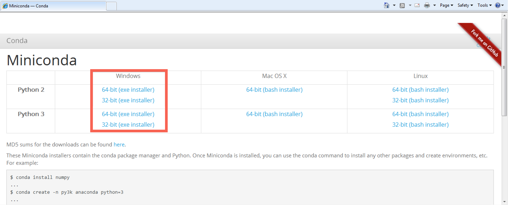
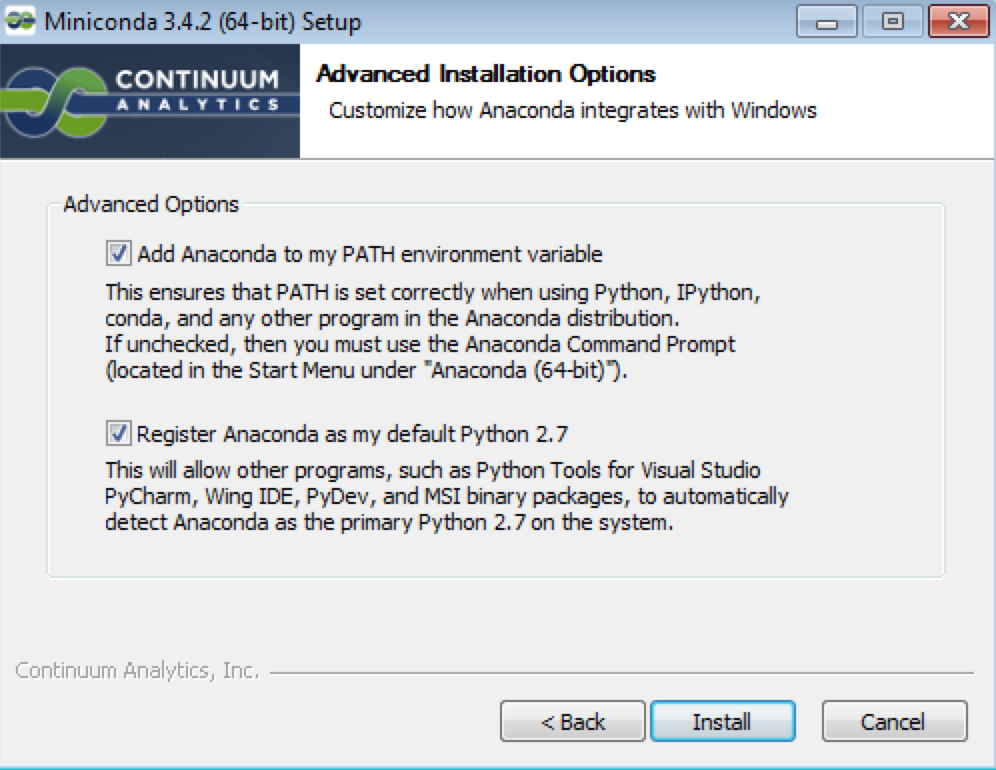
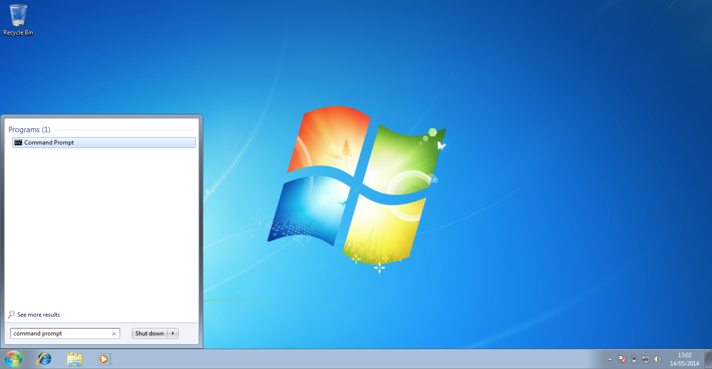
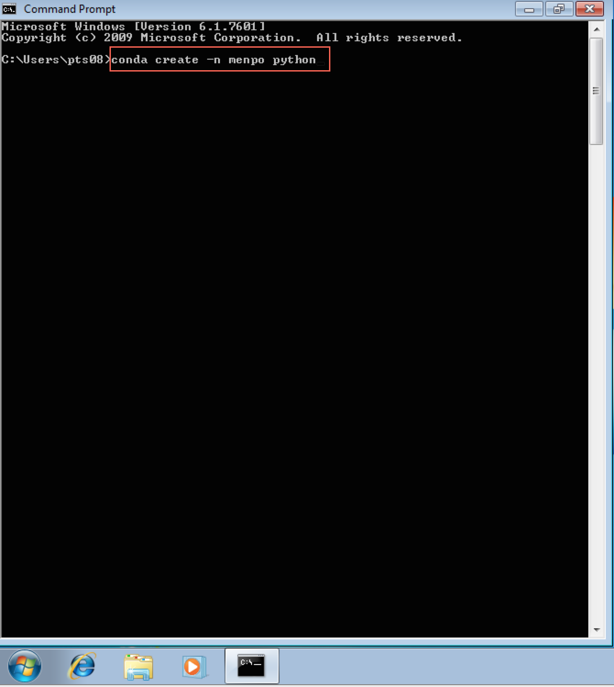
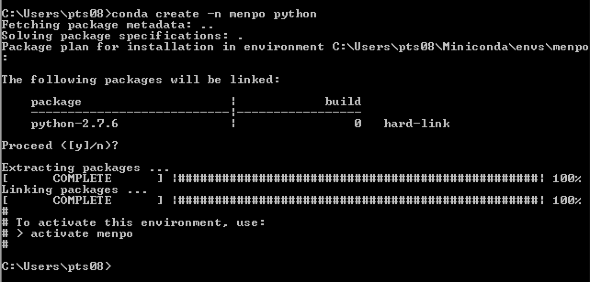
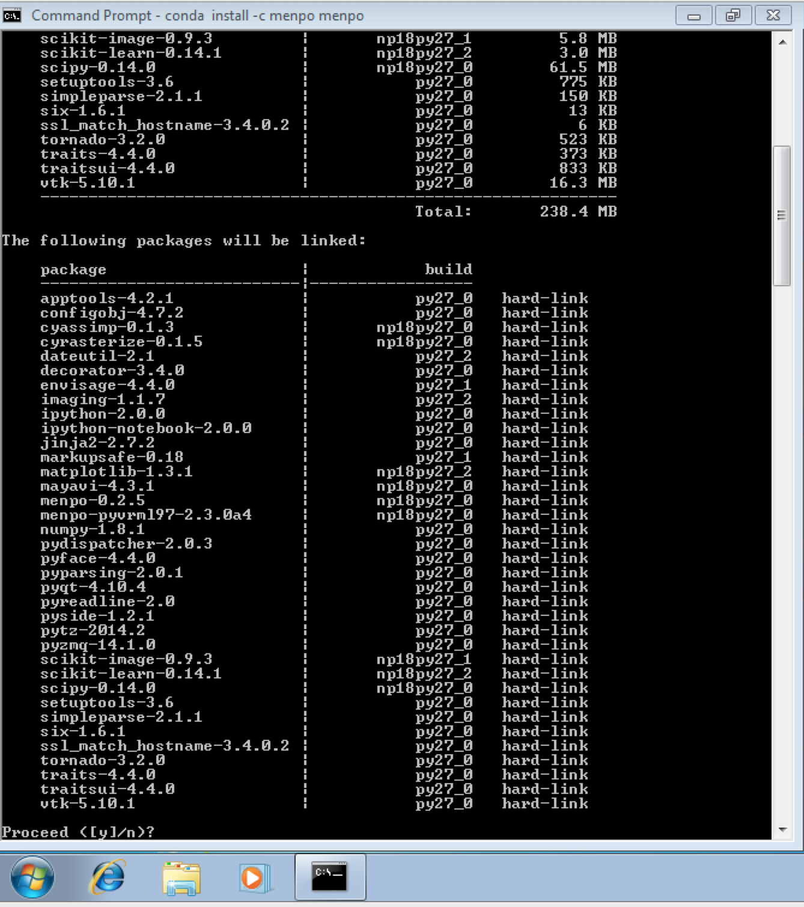
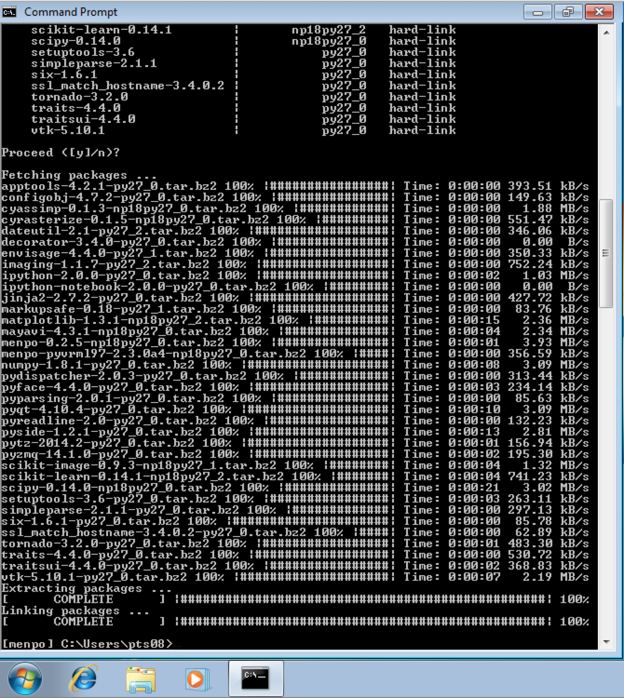

Windows Beginner Installation
=============================

**It is important to note that as part of the installation, you will be creating
an isolated environment to execute Python inside. Make sure that this
environment is activated in order to be able to use Menpo!**

The installation instructions are split up in to a number of sections. Please
follow them carefully, in order:

  1. [Install A Python Environment](#install-a-python-environment)
  2. [Using Conda](#using-conda)
  3. [Setting Up A Fresh Environment](#setting-up-a-fresh-environment)
  4. [Installing The Menpo Project Into Conda](#installing-the-menpo-project-into-conda)
  5. [Begin Using Menpo](#begin-using-menpo)

### <a name="install-a-python-environment"></a>1. Install A Python Environment
First, we need to install a Python environment. The Python environment we will
use is called **conda**, and it is provided by an installation package
called **Miniconda**.

**[Download Miniconda from here](http://conda.pydata.org/miniconda.html)**

Download either the Python 2 or Python 3 copy of Miniconda for your
architecture of Windows (32-bit or 64-bit). If you are unsure what version of
Windows you are running, you can find out by visiting
[this page](http://support.microsoft.com/kb/827218).

********************************************************************************

********************************************************************************

After downloading Miniconda, run the installer and click `Next >` on each
screen that is presented. It is particularly important that both checkboxes are
ticked on the **Advanced Installation Options** page as shown below:

********************************************************************************

********************************************************************************

### <a name="using-conda"></a>2. Using Conda
After installing Miniconda, we should have access to two new commands within
the command prompt. Python, unlike Matlab, does not come with an integrated
development environment and so commands have to be run using the command prompt.
To continue, we need to open a command prompt, which can be found by selecting
**Start** and typing ``command prompt``

********************************************************************************

********************************************************************************
You should have access to a new command
within the terminal, `conda`. You can test this is working by entering the
command
```
C:\>conda -V
```
Which will print something like ``conda 3.17.0``, though the version number *may*
differ.

### <a name="setting-up-a-fresh-environment"></a>3. Setting Up A Fresh Environment
We now need to create an environment to store all of our Python packages inside.
It doesn't matter what path you are inside within the command prompt, the
`conda` command will not create any files *locally*. So, we use the command
```
C:\>conda create -n menpo python
```
********************************************************************************

********************************************************************************

This will inform you that you are creating a new environment and installing
Python inside of it. The environment name is given by `-n menpo` (the
environment will be called `menpo`) and only `python`and it's direct
dependencies will be installed inside by default.

To ensure you want to continue, Conda will prompt you
about if you wish to proceed. Type **y** and **Enter** to continue.
Conda will create a new environment for you and give you some information
about activating your new environment called `menpo`.

********************************************************************************

********************************************************************************

Now, activate the `menpo` environment with the command:
```
C:\>activate menpo
```
********************************************************************************

********************************************************************************

Notice that the command prompt is now prefixed with a label:
```
[menpo] C:\>
```
This let's you know that the `menpo` environment is enabled. It is important
to ensure that the `menpo` environment is activated before attempting to
use Menpo in any way!

### <a name="installing-the-menpo-project-into-conda"></a>4. Installing The Menpo Project Into Conda
Installing all the packages of the Menpo Project only requires a single command:
```
[menpo] C:\>conda install -c menpo menpoproject
```
This will install `menpo`, `menpofit`, `menpodetect`, `menpowidgets` and `menpocli`.
If you do not need all Menpo packages, you can explicitly install any of them as:
```
[menpo] C:\>conda install -c menpo menpo
[menpo] C:\>conda install -c menpo menpofit
[menpo] C:\>conda install -c menpo menpodetect
[menpo] C:\>conda install -c menpo menpowidgets
[menpo] C:\>conda install -c menpo menpocli
[menpo] C:\>conda install -c menpo menpo3d
```
Conda will then attempt to install all of our requirements. It appears there are
many, but this is due to the minimal nature of the environment we originally
created. As before, Conda will prompt you to proceed, type **y** and press
**Enter** to continue.

********************************************************************************

********************************************************************************

It may take a short time to download and install all of Menpo's dependencies,
during which you will see a number of progress bars. The command is complete
when the extracting and linking processes show **COMPLETE**.

********************************************************************************

********************************************************************************

**Congratulations! You have now installed the latest version of the Menpo Project!**

### <a name="begin-using-menpo"></a>5. Begin Using Menpo
In order to start using Menpo, we suggest you have a look through our collection
of [Examples](../../examples/index.md) using Jupyter notebook. Follow the instructions there to download the notebooks and run them.

We strongly advise you to read the _User Guides_ for all the packages in order to
understand the basic concepts behind the Menpo Project. They can be found in:
- [`menpo`](../../menpo/index.md)
- [`menpodetect`](../../menpodetect/index.md)
- [`menpofit`](../../menpofit/index.md)
- [`menpowidgets`](../../menpowidgets/index.md)
- [`menpocli`](../../menpocli/index.md)
- [`menpo3d`](../../menpo3d/index.md)

If you need more help you can always ask on the
[menpo-users](https://groups.google.com/forum/#!forum/menpo-users "menpo-users") mailing list.
